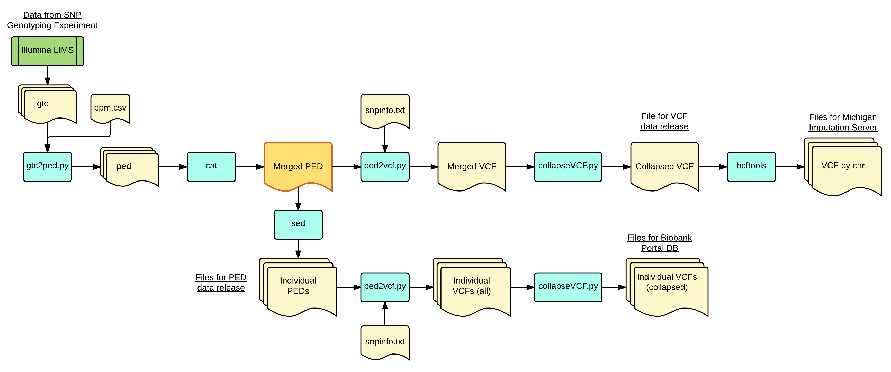
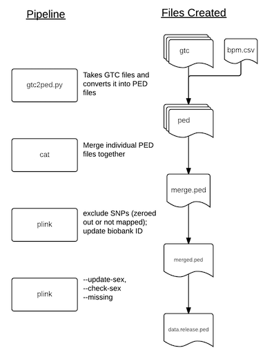
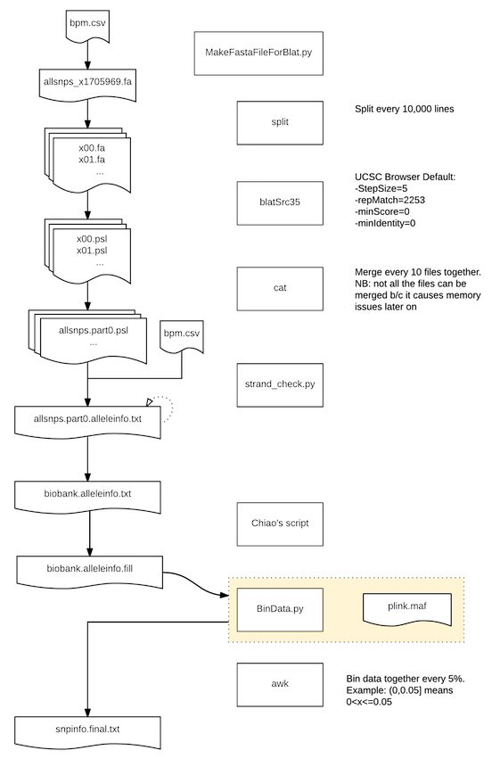

Data processing workflow
=======
### Introduction
1. Alison send xls file (Release Manifest)
2. Copy all the GTCs from illumina-lims to ERISONE (server mounted as /external/ppm-illumina-lims)
3. Run gtc2ped.py
   a. Concordance table, tab-delimited (BiobankID, SentrixID)
   b. Gender table, tab-delimited SentrixID, BiobankID, Gender(1/2)
1. Follow diagram below:

### PART 1: SNP remapping workflow

### PART 2: SNP mapping and snpinfo file creation

